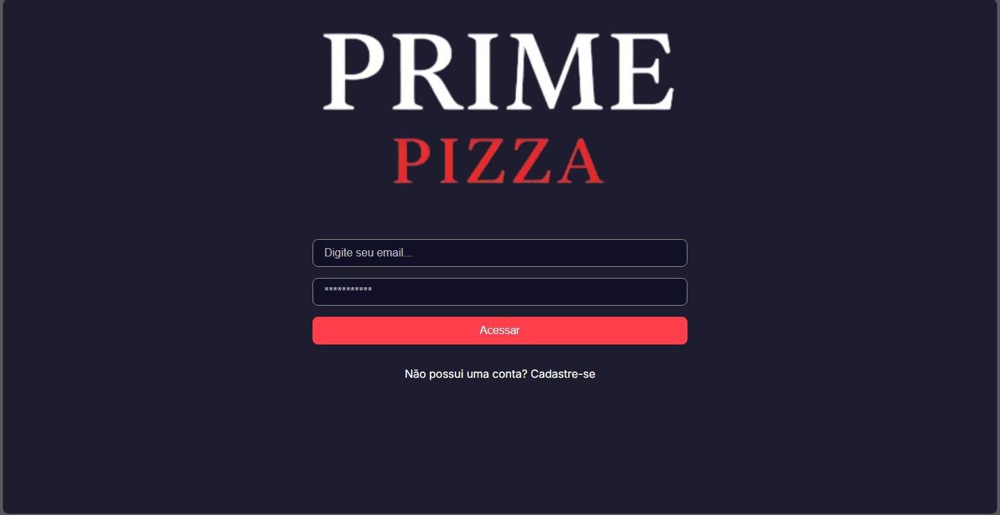
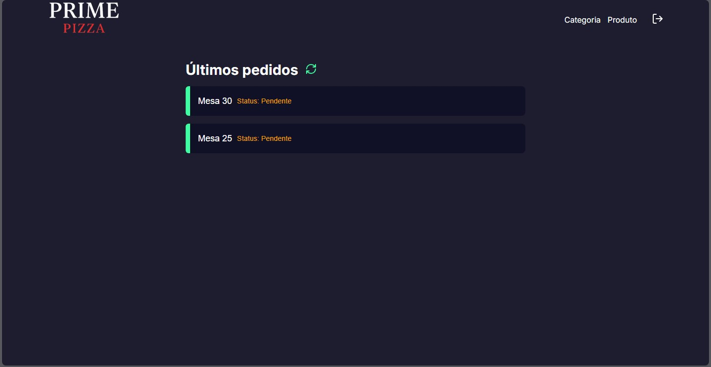
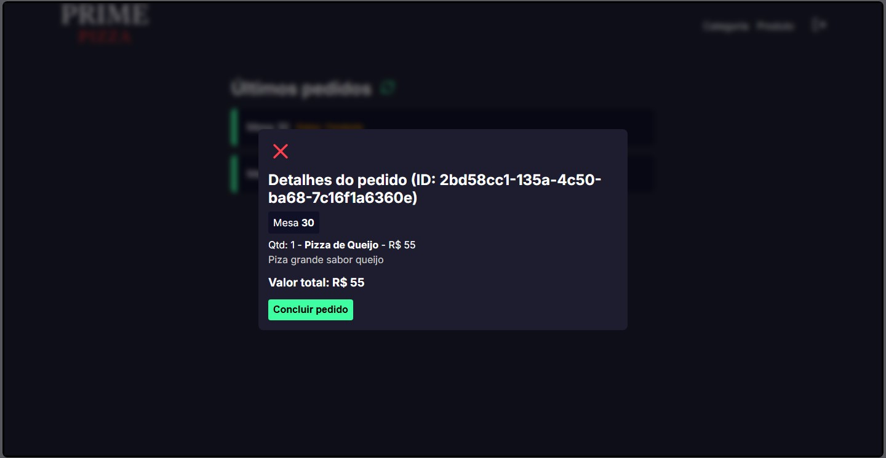
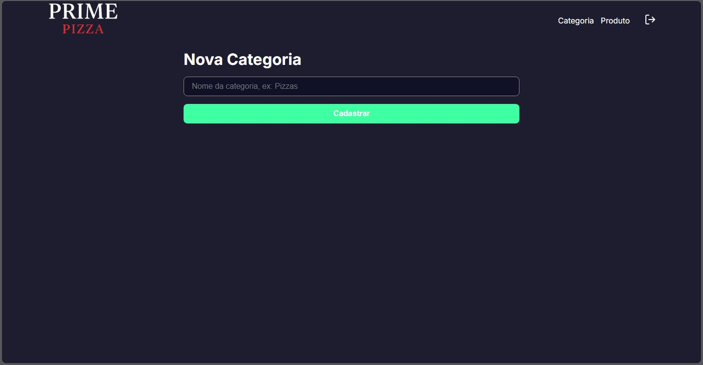
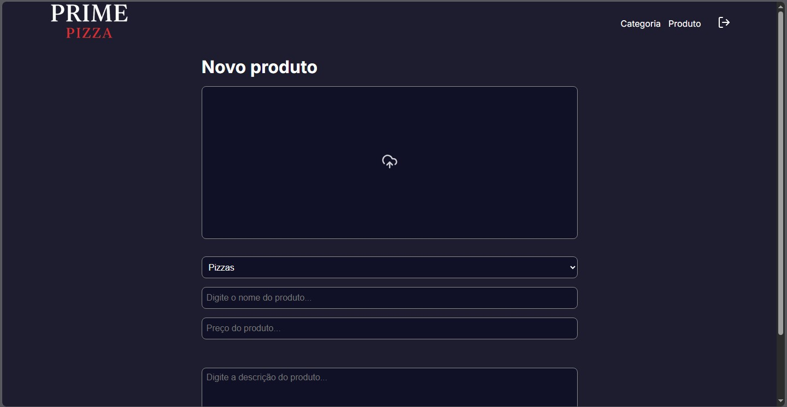

# 🍕 Prime Pizza - Frontend

O **Prime Pizza Web** é a interface administrativa e de gerenciamento em tempo real do ecossistema Prime Pizza. Desenvolvida em **Next.js 14+ (App Router)** com **TypeScript**, a aplicação oferece uma experiência de usuário (UX) fluida, rápida e responsiva para que administradores controlem o fluxo de pedidos de mesas, gerenciem o cardápio e cadastrem produtos de forma dinâmica.

## 🚀 Tecnologias e Ecossistema

* **Framework Core:** Next.js (App Router)
* **Linguagem:** TypeScript
* **Estilização:** SASS (`.module.scss`) para escopo de estilos isolado e limpo.
* **Gerenciamento de Estado Global:** React Context API (`OrderProvider`) para controle de modais e reatividade de pedidos.
* **Notificações:** Sonner (Toasts elegantes e não bloqueantes).
* **Consumo de API:** Axios com instâncias separadas para SSR (Server-side) e CSR (Client-side).
* **Gerenciamento de Sessão:** Cookies seguros para persistência de tokens JWT.

---

## 📸 Demonstração do Sistema

Abaixo estão as interfaces do painel operacional, projetadas com um design escuro moderno e foco em usabilidade:

### 🔒 Tela de Autenticação
Acesso restrito para colaboradores com persistência de estado via Cookies.


### 📊 Painel Principal (Dashboard)
Acompanhamento em tempo real dos pedidos ativos e mesas abertas no salão.


### 📥 Gerenciamento Avançado de Pedidos
Modal interativo integrado ao Contexto React, permitindo inspecionar itens e despachar ou concluir o pedido instantaneamente.


### 📂 Cadastro de Categorias e Produtos
Formulários otimizados com suporte a Server Actions para inserção rápida de dados e upload de banners com preview em tempo real.

| Nova Categoria | Novo Produto |
| :---: | :---: |
|  |  |

---

## 🛠️ Diferenciais Técnicos Aplicados

* **Renderização Híbrida (SSR + CSR):** Uso estratégico de *Server Components* para segurança de dados corporativos e busca de cookies, combinados com *Client Components* (`'use client'`) nas camadas de alta interatividade (como modais e atualizações de listas).
* **Server Actions:** Manipulação de formulários (como o cadastro de categorias) executada diretamente no lado do servidor com a diretiva `"use server"`, reduzindo o JavaScript enviado ao cliente.
* **Arquitetura Baseada em Provedores:** Estado global otimizado utilizando hooks nativos do React para garantir que, ao concluir um pedido, a lista de monitoramento da cozinha seja atualizada instantaneamente sem a necessidade de recarregar a página.

---

## ⚙️ Como Executar o Projeto

Siga os passos abaixo para rodar a interface localmente em ambiente de desenvolvimento.

### Pré-requisitos
* [Node.js](https://nodejs.org/) (Versão LTS estável).
* A API REST do Backend rodando simultaneamente.

### Instalação

1. **Clonar o repositório do Frontend**
   Navegue até o seu diretório de projetos e clone o repositório:
   ```bash
   git clone git@github.com:PaulloMaggio/PrimePizzaFrontend.git
   cd PrimePizzaFrontend
Instalar as dependências
Instale os pacotes e resolva as tipagens do TypeScript:

Bash
npm install
Configurar as variáveis de ambiente
Crie um arquivo .env.local na raiz do projeto e aponte para o endereço da sua API local:

Snippet de código
NEXT_PUBLIC_API_URL="http://localhost:3333"
Iniciar o servidor local
Suba a aplicação para desenvolvimento:

Bash
npm run dev
O painel estará disponível em http://localhost:3000.

👤 Desenvolvedor
Este projeto foi construído do zero focado em boas práticas de componentização e performance por Paulo Magio.

LinkedIn: linkedin.com/in/paulo-magio

GitHub: @PaulloMaggio

Prime Pizza — A melhor pizzaria.